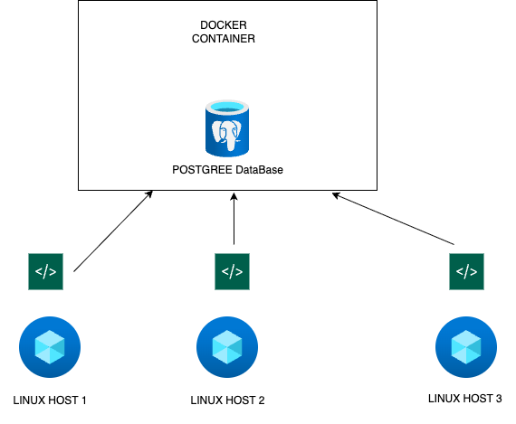

# Linux Cluster Monitoring Agent

## Introduction
This project is a Linux Cluster Monitoring tool designed to collect hardware specifications and real-time resource usage from multiple servers. I built this tool to practice and demonstrate skills in **Linux**, **Bash Scripting**, **Docker**, and **PostgreSQL**.

The goal of this project was to create an agent that can run on any Linux server, collect hardware information (like CPU and RAM) and usage data, and save everything in a centralized database.


**Technologies Used:**
* **Platform:** Linux (CentOS/Rocky)
* **Database:** PostgreSQL
* **Containerization:** Docker
* **Scripting:** Bash
* **Version Control:** Git

## Quick Start
If you want to try  this project yourself, here are the steps to get it up and running:

1.  **Start the PostgreSQL Container**
    ```bash
    # Create and start the container
    ./scripts/psql_docker.sh create db_password
    ```

2.  **Initialize the Database**
    ```bash
    # Run the DDL script to create tables
    psql -h localhost -U postgres -d host_agent -f sql/ddl.sql
    ```

3.  **Register the Host**
    Run this once to store hardware specifications.
    ```bash
    # Args: host, port, db_name, user, password
    ./scripts/host_info.sh localhost 5432 host_agent postgres db_password
    ```

4.  **Collect Usage Data**
    Run this manually to test, or see the next step for automation.
    ```bash
    ./scripts/host_usage.sh localhost 5432 host_agent postgres db_password
    ```

5.  **Configure Crontab (Automation)**
    Edit your crontab (`crontab -e`) to run the usage script every minute:
    ```bash
    * * * * * bash /full/path/to/linux_sql/scripts/host_usage.sh localhost 5432 host_agent postgres db_password > /tmp/host_usage.log 2>&1
    ```

## Implementation

### Architecture
The project architecture consists of a centralized PostgreSQL database that collects data from multiple Linux servers. Each server runs a local Bash agent that insert data to the database.



### Scripts
* **`psql_docker.sh`**: A utility script to manage the PostgreSQL Docker container. It supports `start`, `stop`, and `create` commands to ensure the database environment is correct.
* **`host_info.sh`**: Runs once during installation. It gets static hardware specifications and inserts them into the `host_info` table.
* **`host_usage.sh`**: Runs again and again. It gets the dynamic resource (free memory, CPU idle time, disk I/O) and inserts them into the `host_usage` table.
* **`crontab`**:  Ensuring the database is constantly updated with fresh data.
* **`ddl.sql`**: Defines the database schema.

### Database Modeling
I decided to split the data into two tables to avoid repeating information and ensure data integrity.

**`host_info`**
| Column | Type | Description |
| --- | --- | --- |
| `id` | SERIAL | Primary Key, Auto-incremented ID |
| `hostname` | VARCHAR | Unique name of the server |
| `cpu_number` | INT | Number of CPU cores |
| `cpu_architecture` | VARCHAR | Architecture type (e.g., x86_64) |
| `cpu_model` | VARCHAR | Name/Model of the CPU |
| `cpu_mhz` | FLOAT | Clock speed of the CPU |
| `l2_cache` | INT | Size of L2 cache in KB |
| `total_mem` | INT | Total RAM in KB |
| `timestamp` | TIMESTAMP | Time of registration |

**`host_usage`**
| Column | Type | Description |
| --- | --- | --- |
| `timestamp` | TIMESTAMP | Time of data collection |
| `host_id` | INT | Foreign Key referencing `host_info(id)` |
| `memory_free` | INT | Available RAM in MB |
| `cpu_idle` | INT | Percentage of time CPU is idle |
| `cpu_kernel` | INT | Percentage of time CPU is running kernel code |
| `disk_io` | INT | Number of disk I/O operations |
| `disk_available` | INT | Available disk space in MB |

## Test
Testing was conducted manually in a Linux environment.
1.  **Script Validation:** Verified that `host_info.sh` and `host_usage.sh`
2.  **Database Integration:** Executed scripts and queried the PostgreSQL database (`SELECT * FROM host_usage`) to confirm if data exists.


## Deployment
The application is deployed using **Docker** for the database and **Crontab** for the monitoring agents.
* **Database:** Deployed as a Docker container.
* **Source Code:** Managed via GitHub.
* **Agents:** Deployed directly on the host OS with a  Bash scripts.

## Improvements

1.  **Visualization:** Build a simple web dashboard or connect Grafana to the PostgreSQL database to visualize the usage trends over time.
