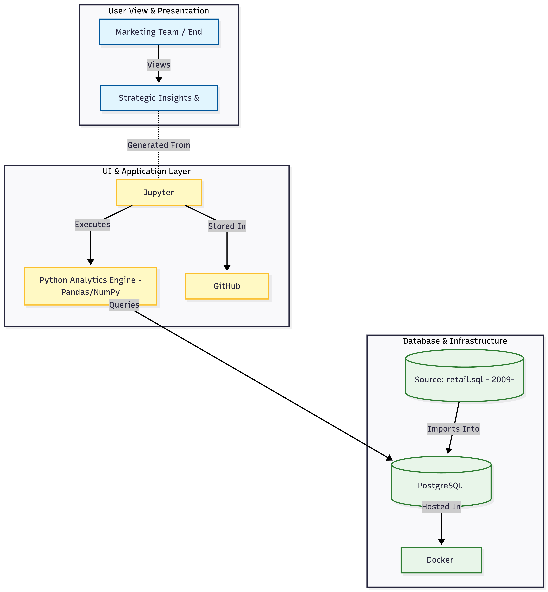

# Retail Data Analytics Project

# Introduction
The London Gift Shop (LGS) is a UK-based online retailer that specializes in all-occasion gifts. For years, the company has relied on transactional data to sell products but has lacked the ability to leverage this data for strategic decision-making.

This project focuses on bridging that gap by building a Data Analytics solution. By migrating their transactional data into a Data Warehouse and performing advanced analytics (such as RFM Segmentation), we aim to provide the marketing team with actionable insights. These insights allow LGS to move from "gut-feeling" marketing to data-driven customer targeting, ultimately helping to increase revenue and customer retention.

**Technologies Used:**
* **Docker:** To containerize the database and analytics environment.
* **PostgreSQL:** Used as the Data Warehouse to store retail transaction data.
* **Jupyter Notebook:** The interactive environment for writing code and visualizing data.
* **Python:** The primary programming language.
* **Pandas & NumPy:** For data wrangling, cleaning, and analysis.
* **Matplotlib & Seaborn:** For creating data visualizations and plotting customer segments.

# Implementation

## Project Architecture
The project follows a standard Data Analytics architecture.
1.  **LGS Web App:** The source of the raw transactional data (CSV files).
2.  **PostgreSQL (Data Warehouse):** A robust database hosted in a Docker container to store cleaned data.
3.  **Jupyter Notebook:** Connected to the Data Warehouse to extract data, perform analysis, and generate visualizations.
4.  **End User:** The marketing team consumes the charts and segmentation reports.

*()*

## Data Analytics and Wrangling
You can find the detailed analysis and code in the following notebook:
* [Retail Data Analytics Notebook](./retail_data_analytics_wrangling.ipynb)

**Business Impact & Strategy:**
By analyzing the data, specifically using **RFM (Recency, Frequency, Monetary) Analysis**, we categorized customers into segments like "Champions," "Potential Loyalists," and "Hibernating."
* **Marketing Strategy:** We can increase revenue by targeting the "Hibernating" segment (customers who bought before but haven't recently) with re-engagement campaigns (e.g., "We miss you" coupons).
* **Retention:** "Champions" can be rewarded with early access to new products to maintain their high lifetime value.

# Improvements
If more time were available, the following improvements could be made:
1.  **Automate the ETL Pipeline:** Currently, the data loading is manual. I would write a Python script to automatically fetch new CSVs from the web app and load them into the database daily.
2.  **Interactive Dashboard:** Migrate the static charts from Jupyter to an interactive tool like Tableau or PowerBI so non-technical stakeholders can filter data themselves.
3.  **Cloud Deployment:** Move the Docker containers from a local machine to a cloud provider (like AWS EC2) so the database and notebook are accessible to the entire team 24/7.
